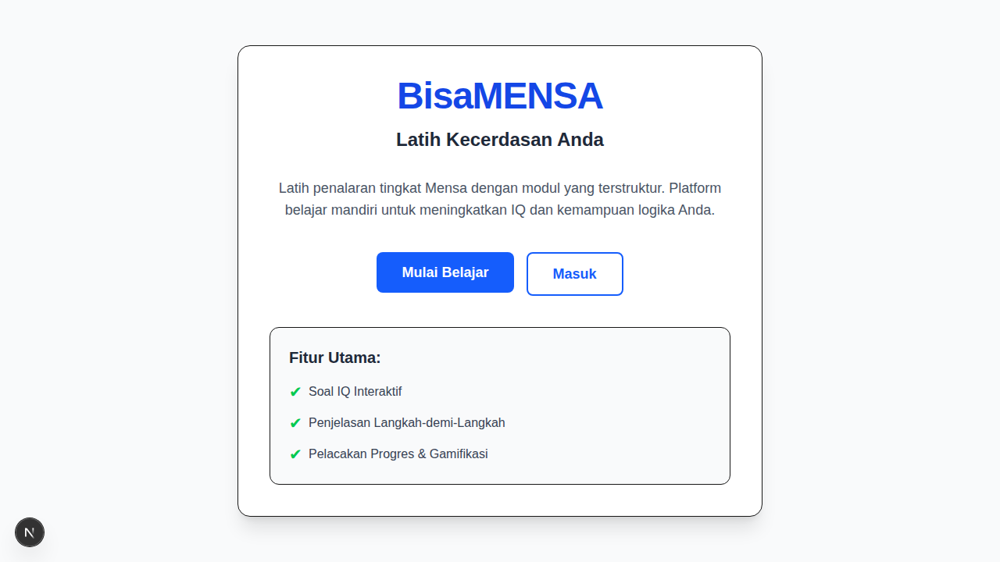

<div align="center">
  
  <br/>
  <h1>🧠 BisaMENSA</h1>
  <p><strong>Latih Kecerdasan Anda — Platform Pembelajaran Interaktif Penalaran IQ (Mensa-style)</strong></p>

  [](https://nextjs.org/)
  [](https://supabase.com/)
  [](https://tailwindcss.com/)
  [](https://www.typescriptlang.org/)

  <p><i>Terinspirasi dari Treehouse & freeCodeCamp, dilengkapi dengan Gamifikasi ala Duolingo!</i></p>
</div>

---

## 🚀 Tentang BisaMENSA

**BisaMENSA** adalah aplikasi web modern *production-ready* yang dirancang bagi mereka yang ingin melatih kemampuan berpikir logis, mempersiapkan diri untuk ujian masuk kerja (CPNS/BUMN), atau sekadar menguji batas kecerdasan (IQ) mereka.

Tidak seperti platform kuis biasa yang hanya memberikan nilai akhir, BisaMENSA berfokus pada **Pembelajaran Terstruktur** dengan memberikan **Penjelasan Logika Langkah-demi-Langkah** setiap kali Anda selesai menjawab.

  <br/>
  <p align="center">
    
  </p>

---

## ✨ Fitur Utama (Preview)

*   📚 **Learning Roadmaps:** Modul terstruktur mulai dari *Fundamental IQ Training* hingga *Advanced Mensa Preparation*.
*   🎮 **Gamification System:** Kumpulkan **XP**, naikkan **Level**, pertahankan **🔥 Streak Harian**, dan berkompetisi di **🏆 Papan Peringkat Global**!
*   💡 **Step-by-Step Reasoning:** Setiap soal dilengkapi dengan penjelasan komprehensif (Tahu di mana Anda salah, pelajari cara berpikir yang benar).
*   📊 **Analitik Kemampuan:** Lacak kelemahan dan kekuatan Anda secara real-time berdasarkan kategori (Logika Deduktif, Pola Angka, Spasial, dll).
*   ⏱️ **Mensa Simulation Mode:** Ujian simulasi 30 menit penuh tekanan dengan estimasi Skor IQ instan.
*   🤖 **AI Question Generator (API):** Endpoint cerdas yang siap diintegrasikan dengan LLM untuk menghasilkan soal IQ tanpa batas!

---

## 🛠️ Tech Stack

*   **Frontend:** Next.js (App Router), React, Tailwind CSS.
*   **Backend & Auth:** Supabase (PostgreSQL), Supabase Auth.
*   **Bahasa:** TypeScript.
*   **Database:** Tabel tersusun secara relasional (`users`, `roadmaps`, `modules`, `lessons`, `questions`, `user_progress`, `user_answers`).

---

## 💻 Cara Instalasi & Menjalankan Proyek (Clone to Run)

Ikuti langkah-langkah ini untuk menjalankan BisaMENSA di mesin lokal Anda.

### 1. Clone Repository
```bash
git clone https://github.com/yourusername/bisamensa.git
cd bisamensa
```

### 2. Install Dependencies
```bash
npm install
```

### 3. Setup Lingkungan Supabase (Environment Variables)
Buat file `.env.local` di root folder proyek Anda dan isi dengan kredensial Supabase Anda:
```env
NEXT_PUBLIC_SUPABASE_URL=https://[PROJECT_ID].supabase.co
NEXT_PUBLIC_SUPABASE_ANON_KEY=[YOUR_ANON_KEY]
```

### 4. Konfigurasi Database (SQL & Seed)
Di dashboard Supabase Anda (SQL Editor), jalankan query yang ada di dalam file `schema.sql` untuk membuat seluruh tabel yang dibutuhkan.

Setelah tabel terbuat, Anda **HARUS** mengisi database (Seed) agar roadmap dan soal-soal muncul di aplikasi. Jalankan perintah:
```bash
npm run seed
```

### 5. Jalankan Development Server
```bash
npm run dev
```
Buka [http://localhost:3000](http://localhost:3000) di browser Anda. Daftarkan akun baru, login, dan mulailah melatih otak Anda!

---

## 🧠 Struktur Kurikulum (Berdasarkan Standar Psikotes)

Soal-soal dalam BisaMENSA didesain mengambil inspirasi dari standar akademik tes kecerdasan nyata (Baca `RESEARCH.md` untuk detail lebih lanjut):
1.  **Pola Angka (Deret Aritmatika & Geometri)**
2.  **Logika Deduktif & Silogisme**
3.  **Analogi Verbal (IST - Intelligenz Struktur Test)**
4.  **Penalaran Spasial & Pola Abstrak (CFIT / Raven's Progressive Matrices)** *(Mendukung soal berbasis visual/gambar!)*

---

## 🤝 Kontribusi

Merasa tertantang untuk menambahkan soal yang lebih sulit? Ingin memperbaiki UI? Pull Requests sangat diterima!

1. Fork proyek ini.
2. Buat branch fitur Anda (`git checkout -b feature/MensaAdvancedSoal`).
3. Commit perubahan Anda (`git commit -m 'Menambahkan soal matriks 3x3'`).
4. Push ke branch (`git push origin feature/MensaAdvancedSoal`).
5. Buka Pull Request.

---

<div align="center">
  <p>Dibuat dengan ❤️ untuk kecerdasan Indonesia.</p>
</div>
